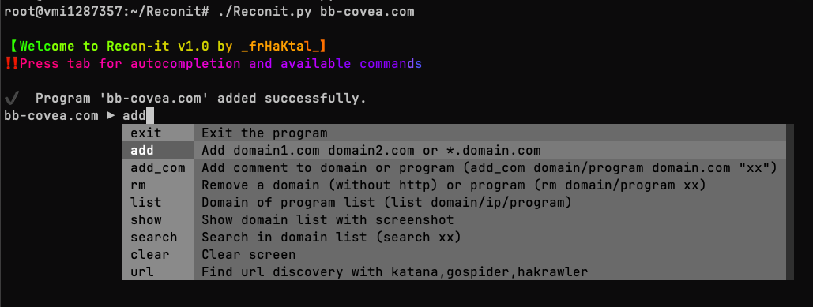
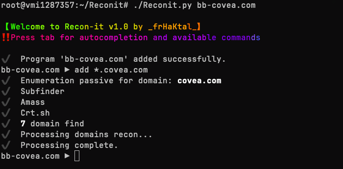
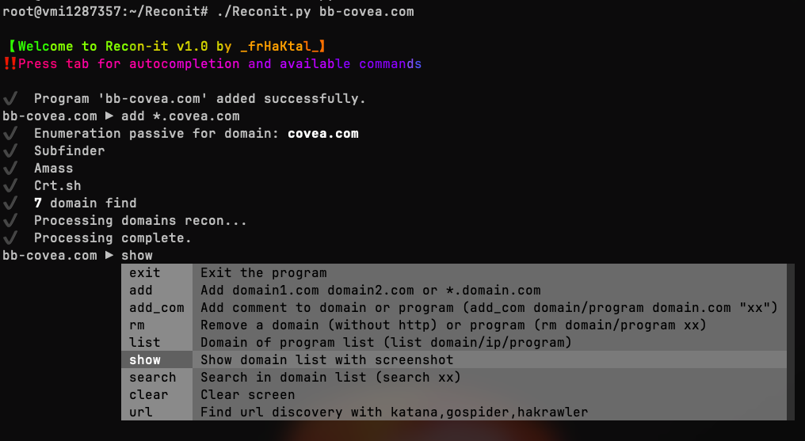
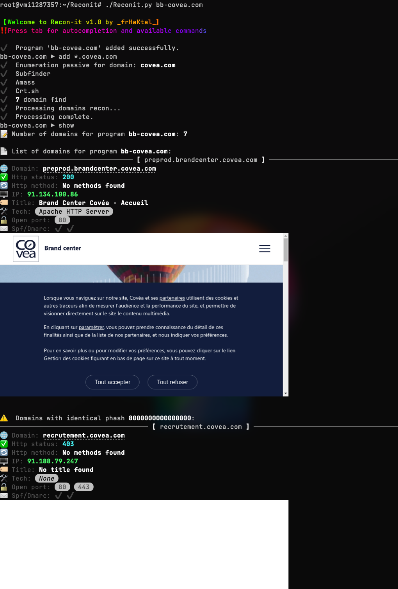

**Recon-it** was created to address the need for automation in the pentesting/bug bounty phase, and especially to provide an overview during this phase.
Only for **Macos** with **iTerm2** and **font-jetbrains-mono-nerd-font** and **imgcat** (brew install --cask font-jetbrains-mono-nerd-font)

